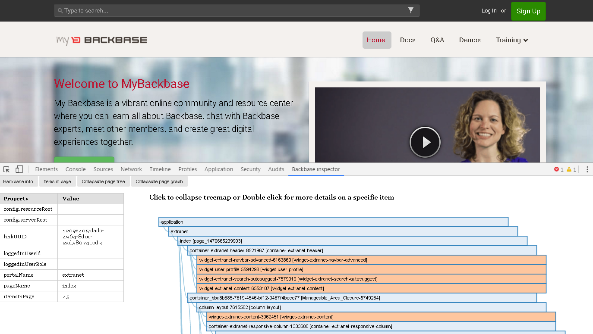

#  bbinspector

Using dev-tools in order to inspect and navigate portal model, so you can visualize portal tree and inspect pages and each item:

## Requirements
 - node v4.4.3
 - npm v2.15.1
 - successfully tested on Backbase Portal 5.5.x and 5.6.x

## Setup
First of all, clone this repo into your workspace directory. 

    $ cd /<myWorkspace>/bbinspector-chrome-extension
    $ bower install
	$ npm install

## Run & Develop

	$ cd /<myWorkspace>/bbinspector-chrome-extension
	$ grunt -v

 - Go to Chrome extensions tab (chrome://extensions/)
 - Check on "develop mode"
 - Load an unpacked extensions pointing your dist dir (/<myWorkspace>/bbinspector-chrome-extension/dist)
 - Reload whenever is necessary during your development

## Dist

Generate a dist release, ready for your Google Chrome browser

 	$ cd /<myWorkspace>/bbinspector-chrome-extension
	$ grunt -v dist

### Upload an unpacked version

 - Go to Chrome extensions tab (chrome://extensions/)
 - Check on "develop mode"
 - Load an unpacked extensions pointing your dist dir (/<myWorkspace>/bbinspector-chrome-extension/dist)
 - Navigate on a site using Backbase Portal, open your Chrome DevTools (F12), and enjoy it!